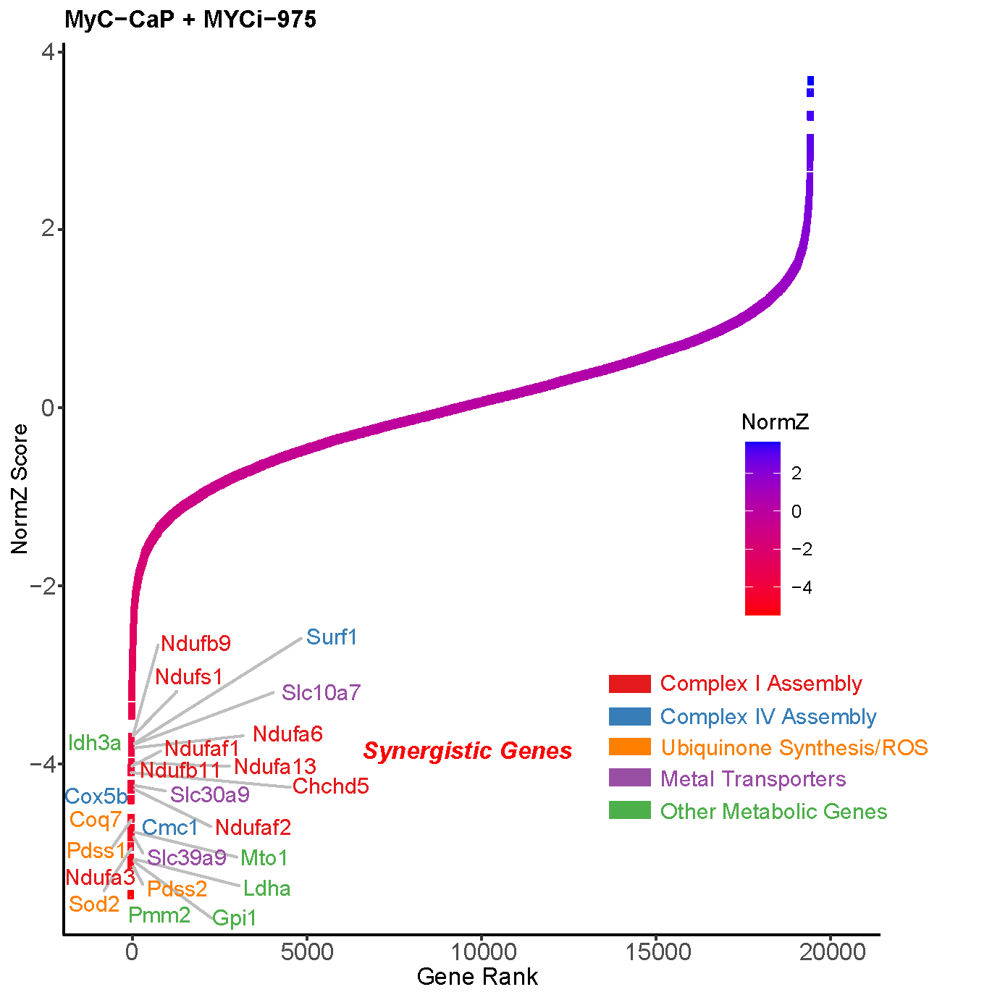

# 1. CRISPR Screen Computational Pipeline for Identifying Synthetic Lethal Targets to MYC inhibitors (or any other inhibitors)
This repository provides a **step-by-step computational workflow** for analyzing **whole-genome CRISPR screening data**, from raw sequencing files to hit identification and pathway analysis.  
While this guide uses a **MYC inhibitor study** as an example, the methods described here are broadly applicable to **any CRISPR screen** investigating synthetic lethality, biomarker identification and combination drug strategies.  
This pipeline leverages **MAGeCK** and **DrugZ**, two widely used tools for CRISPR screen analysis, and provides detailed instructions for setup, execution, and interpretation of results.  

---

## Table of Contents
1. [Introduction / Overview](#introduction--overview--experimental-design)
2. [Merging FASTQs](#2-merging-fastqs)
3. [Quality Control](#3-quality-control)
4. [MAGeCK Setup](#4-mageck-setup)
5. [MAGeCK Count](#5-mageck-count)
6. [MAGeCK MLE](#6-mageck-mle)
7. [DrugZ Analysis](#7-drugz-analysis)
8. [Visualization](#8-visualization)
9. [Pathway Analysis](#9-pathway-analysis)

---

## Introduction / Overview / Experimental Design

This pipeline was developed to pinpoint genes whose loss enhances or diminishes sensitivity to the small-molecule MYC inhibitor **MYCi975**. We used an unbiased, genome-wide CRISPR screening approach and validated hits using multiple downstream analyses.  
Chemo-genomic screens are useful to identify combination strategies and genetic biomarkers for clinical trials 

The screen involves the following key conditions:  

- **T0 (Baseline)** – Initial cell population before treatment  
- **T12 DMSO (Control)** – Cells treated with DMSO (vehicle) for 12 days  
- **T12 MYC Inhibitor (Treated)** – Cells treated with MYCi975 for 12 days  

By comparing guide RNA (gRNA) enrichment or depletion between these conditions, we can **identify genes that influence MYC inhibitor sensitivity**.  

Key features of this workflow include:

- **Pre-processing FASTQ files** (merging lanes, quality control)  
- **Guide quantification and normalization** (using MAGeCK)  
- **Hit identification** (MAGeCK MLE and DrugZ)  
- **Functional analysis and pathway enrichment** (Using R)

Follow the steps below to reproduce the key analyses or adapt them to your CRISPR screen data

Schematic of typical whole genome CRISPR screen below: 


---

## 2. Merging FASTQs

### 
Combine sequencing data from multiple lanes (L001-L004) for each biological sample to create per-sample FASTQ files. In Illumina sequencing, each sample is typically sequenced across multiple lanes

### Sample Structure
This workflow merges data for 6 key samples (for my workflow, but naming is different depends on your experiment and how the sequencing facility names the samples):

| Sample Name       | Description                          | Time Point | Treatment    | Replicate |
|-------------------|--------------------------------------|------------|--------------|-----------|
| `T0_POP_S1`       | Initial                              | Day 0      | None         | Rep 1     |
| `T12_DMSO_POP_S2` | Control                              | Day 12     | DMSO         | Rep 1     |
| `T12_MYCi_POP_S3` | Treated                              | Day 12     | MYCi975      | Rep 1     |
| `T0_CLONE_S4`     | Initial                              | Day 0      | None         | Rep 2     |
| `T12_CLONE_S5`    | Control                              | Day 12     | DMSO         | Rep 2     |
| `T12_CLONE_S6`    | Treated                              | Day 12     | MYCi975      | Rep 2     |


### Input File Structure
Original sequencing files follow this naming pattern:  
`{SAMPLE}_{LANE}.fastq.gz`  
Example: `T0_POP_S1_L001.fastq.gz`

Raw sequencing files follow this organization pattern:
```
📁 count/
├── T0_POP_S1_L001.fastq.gz
├── T0_POP_S1_L002.fastq.gz
├── T12_DMSO_POP_S2_L001.fastq.gz
└── ... (etc)
```
### Basic Merging steps 
1. Create output directory
   ```bash
   mkdir -p ./analysis
   ```
2. Merge lanes (Example of merging lanes for T0_POP_S1 using zcat)
   ```bash
   zcat ./T0_POP_S1*.fastq.gz | gzip -c > ./analysis/T0_POP_S1.fastq.gz
   ```
3. Important notes:
- zcat: Stream decompresses multiple .gz files (reads compressed or .gz files without manual decompression)
- *.fastq.gz: Wildcard matches all lanes (L001-L004)
- gzip -c: Maintains compression in final output
- `> ./analysis/...`: Redirects output to merged file in analysis directory

4. I wrote a bash script `1_merge.sh` ([view raw script](Script/1_merge.sh)), that makes the process easier and automated. The bash script:
- Creates output directory
- Allows all groups to be merged at the same time
- Handles gzipped FASTQ files well
- The bash code should be modified based on your file names and directories/condiitons

### Execution Steps/Code Implementation
1. **Navigate to data directory**  
   ```bash
   cd "/mnt/research/Urology/abdulkadir_lab/William Yang/Github/1_1 in vitro CRISPR screen/analysis/count"
   ```

2. **Make executable and run merging script in the same folder as data directory (where the raw fastq.gz data are stored)**  
   ```bash
   chmod +x 1_merge.sh  
   ./1_merge.sh 
   ```

3. **Verify output**  
   Expected structure in `analysis/` directory, which are now the merged files from all lanes:
   ```
   📁 analysis/
   ├── T0_POP_S1.fastq.gz
   ├── T12_DMSO_POP_S2.fastq.gz
   ├── T12_MYCi_POP_S3.fastq.gz
   └── ... (other samples)
   ```


---

## 3. Quality Control

Next, we need to conduct QC on the merged files to ensure they have high base quality scores. 

### Execution Steps/Code Implementation

1. **Navigate to analysis directory (all the merged files should be in a folder called analysis)**  
   ```bash
   cd "/mnt/research/Urology/abdulkadir_lab/William Yang/Github/1_1 in vitro CRISPR screen/analysis"
   ```

2. **Run FastQC in parallel (I like to use parallel so multiple files can be run at the same time to save time)**  
   ```bash
   parallel fastqc ::: *.fastq.gz
   ```
   *Note: Requires GNU Parallel, need to be installed first for parallel to work. For 4-core acceleration:*  
   ```bash
   parallel -j 4 fastqc ::: *.fastq.gz
   ```


### Expected Output
```
📁 analysis/
├── 📄 T0_POP_S1_fastqc.html      # Interactive QC report
├── 📄 T0_POP_S1_fastqc.zip       # Raw QC data
├── 📄 T12_DMSO_POP_S2_fastqc.html
└── ... (other samples)
```

### Key QC Metrics to Verify
| Metric                  | Good Outcome                 | Potential Issue             |
|-------------------------|------------------------------|------------------------------|
| **Per Base Sequence**   | Positions ≥ Q30          | Quality drops at read ends   |
| **Adapter Content**     | < 5%                         | Needs adapter trimming       |
| **GC Content**          | Matches library prep (~40-60%)| Contamination                |

An example of the report (T0_rep1_fastqc.html) is in the Figures directory  [Figures directory](./Figures)

---

## 4. MAGeCK Setup

We need to configure the computational environment for CRISPR screen analysis using MAGeCK and MAGeCK-VISPR tools as described in [Wang et al. (2019)](https://doi.org/10.1038/s41596-018-0113-7).
**MAGeCK** (Model-based Analysis of Genome-wide CRISPR-Cas9 Knockout) is a computational toolkit designed to analyze CRISPR screening data. It does key functions such as **Hit Identification** and **MLE** (Maximum Likelihood Estimation) for multi-condition experiments 
To analyze CRISPR screening using MAGeCK, I use additional tools such as **Miniconda**, **MAGeCK** and **Python 3**

### Installation Steps

1. **Install Miniconda and Python 3 (if you have not yet)**  
[Instructions to install MiniConda](https://docs.anaconda.com/miniconda/install/)  
    
2. **Add Conda Channels**  
   Configure channels in priority order:
   ```bash
   conda config --add channels conda-forge
   conda config --add channels bioconda
   ```

3. **Create Isolated Environment**  
   Install MAGeCK and MAGeCK-VISPR in dedicated environment:
   ```bash
   conda create -n mageck-vispr mageck mageck-vispr python=3
   ```

4. **Activate Environment**  
   Start using the tools:
   ```bash
   conda activate mageck-vispr
   ```

5. **Additional Notes**
 - MAGeCK-VISPR requires Python 3.6+
 - Always activate environment before analysis
 - Documentation Links: 
    - [MAGeCK Official Docs](https://sourceforge.net/p/mageck/wiki/Home/)
    - [MAGeCK-VISPR Bitbucket](https://bitbucket.org/liulab/mageck-vispr)

--- 

## 5. MAGeCK Count

MAGeCK Count converts raw FASTQ files into sgRNA count tables by:
- Sequence alignment to sgRNA library
- Read count normalization

### Code Implementation

**Input Directory** (`count/`):
```
📁 count/
├── 📄 lib.csv                    # sgRNA library file [Download example](./Data/lib.csv)
├── 📄 T0_rep1.fastq.gz           # Initial replicate 1
├── 📄 T0_rep2.fastq.gz           # Initial replicate 2
├── 📄 T12_rep1_DMSO.fastq.gz     # DMSO control replicate 1
├── 📄 T12_rep2_DMSO.fastq.gz     # DMSO control replicate 2
├── 📄 T12_rep1_MYCi.fastq.gz     # MYCi treatment replicate 1
└── 📄 T12_rep2_MYCi.fastq.gz     # MYCi treatment replicate 2
```

```bash
mageck count \
  -l lib.csv \                  # Library file defining sgRNA-gene relationships
  -n MYCi_screen \              # Output filename prefix
  --sample-label "T0_rep1,T0_rep2,T12_DMSO_rep1,T12_DMSO_rep2,T12_MYCi_rep1,T12_MYCi_rep2" \  # Sample names
  --fastq T0_rep1.fastq.gz T0_rep2.fastq.gz \        # Time 0 replicates
        T12_rep1_DMSO.fastq.gz T12_rep2_DMSO.fastq.gz \  # DMSO controls
        T12_rep1_MYCi.fastq.gz T12_rep2_MYCi.fastq.gz \  # MYCi-treated samples
  --norm-method median \        # Normalization using median scaling
  --pdf-report \                # Generate QC PDF
  --count-n \                   # Include sgRNAs with ambiguous bases (N)
  --unmapped-to-file \          # Save unmapped reads for debugging
```

### Key Parameters Explained

| Parameter | Purpose | Importance |
|-----------|---------|------------|
| `-l lib.csv` | sgRNA library file (ID, sequence, gene) | Critical for mapping reads to targets |
| `--sample-label` | Names for samples in order | Maintains experimental metadata |
| `--norm-method median` | Median normalization | Reduces technical variability between samples |
| `--pdf-report` | Generates QC report | Reveals mapping rates, Gini index, sample correlations |
| `--count-n` | Count sgRNAs with Ns | Maintains library complexity metrics |
| `--unmapped-to-file` | Saves failed mappings | Helps diagnose sequencing/library issues |

### Execution Steps/Code Implementaion

1. **Prepare Library File** ([Library example I have](./Data/lib.csv))  
    Example `lib.csv` structure:
   ```csv
   sgRNA_ID,Sequence,Gene
   sgrna_001,AGCTCGATCGAT,CASP3
   sgrna_002,TCGAGCTAGCTA,MYC
   ```

2. **Run Count Command** ([mageck_count bash script I wrote for automation](./Script/4_mageckcount.sh))
   ```bash
   ./4_mageckcount.sh 
   ```
    - The bash code should be modified based on your file names and directories/condiitons

3. **Verify Outputs** ([Outputs](./Data)):
```
📁 analysis/
├── 📄 MYCi_screen.count.txt          # Raw sgRNA counts
├── 📄 MYCi_screen.count_normalized.txt  # Median-normalized counts
├── 📄 MYCi_screen.countsummary.txt   # QC metrics summary
├── 📄 MYCi_screen.pdf                # Visual QC report
```
### Quality Control Metrics
Check `MYCi_screen.countsummary.txt` for:
1. **Mapping Rate**: Should be >60% (indicates good library representation)
2. **Gini Index**: <0.2 (measures sgRNA distribution evenness)
3. **Zero Counts**: <5% of sgRNAs

---

## 6. MAGeCK MLE
Identify gene essentiality changes under different experimental conditions using **Maximum Likelihood Estimation**. Designed for:
- Multi-condition comparisons (e.g., drug vs control vs baseline)
- Time-course experiments
- Complex experimental designs
- MAGeCK models all samples simultaneously, generating a single beta score per gene for each condition.
- A negative beta suggests the gene knockout is detrimental under that condition (negative selection), whereas a positive beta implies the gene knockout provides a growth advantage (positive selection).

### Design Matrix Explained
Your `designmatrix.txt` defines experimental relationships:

```txt
Samples        baseline  mock_day12  myci_Day12
T0             1         0           0
T12_DMSO_rep1  1         1           0
T12_DMSO_rep2  1         1           0
T12_MYCi_rep1  1         0           1
T12_MYCi_rep2  1         0           1
```
- Baseline column must be 1 for all samples (represents T0).
- Condition columns (mock, myci) are 1 if the sample belongs to that group, otherwise 0.

### Code Implementation

```bash
mageck mle \
  --count-table MYCi_screen.count.txt \  # The sgRNA count file from mageck count
  --design-matrix designmatrix.txt \     # Experimental design definition/link samples to conditions
  --norm-method median \                 # Median normalization (matches count step)
  --output-prefix myci_vs_dmso_mle       # Output file prefix
```

### Key Parameters

| Parameter | Function |
|-----------|----------|
| `--count-table` | Input normalized counts from `mageck count` |
| `--design-matrix` | Defines experimental conditions and replicates |
| `--norm-method` | Consistent normalization with count step |
| `--output-prefix` | Names output files systematically |

### Output Files
```
📁 analysis/
├── myci_vs_dmso_mle.gene_summary.txt   # Contains gene-level beta scores, p-values, and FDR values
├── myci_vs_dmso_mle.sgrna_summary.txt    # Provides sgRNA-level data for each gene
```
**Gene-Level Results**  ([`myci_vs_dmso_mle.gene_summary.txt`](Data/myci_vs_dmso_mle.gene_summary_2.txt)):
The output from the MAGeCK MLE analysis provides gene-level metrics under both control (DMSO) and MYCi975 (treated) conditions. 

| Gene   | sgRNA | mock_day12\|beta | mock_day12\|z | mock_day12\|p-value | mock_day12\|fdr | mock_day12\|wald-p-value | mock_day12\|wald-fdr | myci_Day12\|beta | myci_Day12\|z | myci_Day12\|p-value | myci_Day12\|fdr | myci_Day12\|wald-p-value | myci_Day12\|wald-fdr | **β_difference** |
|--------|-------|-----------------|---------------|---------------------|----------------|---------------------------|---------------------|-----------------|---------------|---------------------|----------------|---------------------------|---------------------|------------------|
| Cox5b  | 1     | -0.44819        | -0.72558      | 0.28817             | 0.8026         | 0.4681                    | 0.83634             | -1.5189         | -2.4589       | 0.079891            | 0.48518        | 0.013936                  | 0.14398             | **-1.07071**     |
| Ldha   | 3     | -0.67051        | -1.6812       | 0.16816             | 0.65251        | 0.092716                  | 0.59226             | -1.551          | -3.8338       | 0.0065249           | 0.10637        | 0.00012616                | 0.0033037           | **-0.88049**     |
| Nadk2  | 1     | -1.0989         | -1.2521       | 0.11642             | 0.56075        | 0.21053                   | 0.74249             | -1.8799         | -2.142        | 0.057799            | 0.40924        | 0.032196                  | 0.28892             | **-0.781**       |
| Gpi1   | 5     | -1.0118         | -2.9941       | 0.017057            | 0.20711        | 0.0027525                 | 0.038935            | -1.7738         | -5.2241       | 0.00030826          | 0.01432        | 1.75E-07                  | 3.96E-05            | **-0.762**       |
| Ndufa3 | 5     | -0.55949        | -2.0438       | 0.14288             | 0.60483        | 0.040971                  | 0.34809             | -1.2837         | -4.6438       | 0.0041102           | 0.076118       | 3.42E-06                  | 0.00025119          | **-0.72421**     |

- **Gene:** The gene symbol.
- **sgRNA:** The number of sgRNAs targeting the gene.
- **mock_day12\|beta:** The beta score for the DMSO (control) condition at day 12. This score represents the effect of gene knockout under normal conditions (AKA essential genes in that cell line).
- **myci_Day12\|beta:** The beta score for the MYCi975 (treated) condition at day 12. This indicates the effect of gene knockout under drug treatment.
- **β_difference (ΔBeta):** This is a new column calculated as:
  ``` 
  ΔBeta = beta_myci_Day12 - beta_mock_day12
  ```
  **ΔBeta** quantifies the difference in effect between the MYCi975 treatment and the DMSO control. It allows you to quickly identify genes where the impact of knockout differs significantly between conditions.
  Essentially ΔBeta looks at genes that are selectively more detrimental to MYCi975 than DMSO (synthetic lethal interactions)
    - _Negative_ = Enhanced essentiality in MYCi  
    - _Positive_ = Reduced essentiality in MYCi  
    - **IMPORTANT** You can now rank the genes that will be dependent on MYC inhibitior (or your inhibitor of interest) based on ΔBeta, top ranked genes or those with lowest ΔBeta will be genes when inhibited that would synergize with the drug and can serve as biomarkers

Here's how to document your DrugZ analysis in a clear, cohesive format matching your previous MAGeCK documentation style:

---

## 7. DrugZ Analysis

Alternative to the MAGeCK MLE method above, my top choice for hit calling in chemogenomic screens is **DrugZ**. DrugZ identifies treatment-specific genetic dependencies using a Z-score–based approach (Hart *et al.*, [2015](https://doi.org/10.1016/j.cell.2015.11.015)). It is particularly effective for:

- Paired control/treatment comparisons  
- Synthetic lethal interaction discovery  

### Code Implementation  

I execute DrugZ via a Jupyter Notebook. The `drugz.py` file (available from the [Hart Lab GitHub repository](https://github.com/hart-lab/drugz)) is placed in the same folder as the notebook. Below is the annotated code used for the analysis:

**Jupyter Notebook** ([DrugZ.ipynb](./Data/DrugZ.ipynb)):  
```python
# Import necessary packages 
import numpy as np                   # For numerical operations
import pandas as pd                  # For data manipulation and analysis
import drugz as dz                   # For performing DrugZ analysis on CRISPR screening data

# Configuration
class Args:
    infile = "analysis/count/MYCi_screen.count_2.txt"          # Normalized count matrix
    drugz_output_file = "analysis/drugz_results.txt"           # Gene Z-scores & FDR
    fc_outfile = "analysis/fc_results.txt"                     # sgRNA fold changes
    control_samples = "T12_DMSO_rep1,T12_DMSO_rep2"            # Control sample headers
    drug_samples = "T12_MYCi_rep1,T12_MYCi_rep2"               # Treatment sample headers
    remove_genes = "LacZ,luciferase,EGFR"                      # Non-targeting controls
    unpaired = False                                           # Paired analysis
    pseudocount = 5                                            # Prevents division by zero
    half_window_size = 500                                     # Local noise estimation

# Execute analysis
drugz_results = dz.drugZ_analysis(Args())
```

# Key Parameters  

| Parameter           | Purpose                                             | Optimal Setting                           |
|---------------------|-----------------------------------------------------|-------------------------------------------|
| `control_samples`   | Specifies control condition columns               | Must exactly match headers in the count file  |
| `drug_samples`      | Specifies treatment condition columns             | Requires at least 2 replicates            |
| `remove_genes`      | Excludes non-targeting guides or control genes      | E.g., `"LacZ,luciferase,EGFR"`             |
| `pseudocount`       | Prevents division by zero by smoothing counts       | Default is `5`                           |
| `half_window_size`  | Used for local noise estimation in sgRNA data       | Default is `500` for whole-genome screens  |

# Execution Steps

1. **Prepare Input**:  
   - Use the MAGeCK-normalized counts file (`MYCi_screen.count.txt`) generated from step 5, ensuring that the column headers match the sample names provided in the `Args` class.
   - Place the `drugz.py` file in the same directory as your Jupyter Notebook (download from [here](https://github.com/hart-lab/drugz)).

2. **Run the Notebook**:  
   - Open and execute the [DrugZ.ipynb](./Data/DrugZ.ipynb) file.

3. **Output Files**:  
   📁 analysis/  
   ├── 📄 drugz_results.txt  # Gene Z-scores, p-values, FDR  
   └── 📄 fc_results.txt     # sgRNA log2(fold changes)  


### Results Interpretation  

**Output Structure ([drugz_results.txt](./Data/drugz_results.txt))**:  
```plaintext
GENE    sumZ    numObs  normZ   pval_synth  rank_synth  fdr_synth   pval_supp  rank_supp   fdr_supp
Pmm2    -25.69  10      -6.85   3.71e-12    1           7.21e-08    1          19462       1
Pdss2   -24.07  10      -6.41   7.09e-11    2           4.77e-07    1          19461       1
Gpi1    -24.05  10      -6.41   7.36e-11    3           4.77e-07    1          19460       1
Ldha    -18.49  6       -6.36   9.99e-11    4           4.86e-07    1          19459       1
Sod2    -23.27  10      -6.20   2.84e-10    5           1.1e-06     1          19458       1
Ndufa3  -22.78  10      -6.07   6.41e-10    6           2.08e-06    1          19457       1
```

**Key Columns**:  
- **normZ**: The normalized Z-score for the gene, reflecting the magnitude and direction of the treatment effect.  
  - **Negative**: Enhanced drug sensitivity (indicative of synthetic lethality).  
  - **Positive**: Potential drug resistance conferred by gene KO
- **pval_synth**: The p-value assessing the statistical significance of the synthetic lethal effect.
- **rank_synth**: Synthetic lethal rank

*Reference*: Medina Colic et al. (2019). [Identifying chemogenetic interactions from CRISPR screens with drugZ](https://genomemedicine.biomedcentral.com/articles/10.1186/s13073-019-0665-3)  
Genome Medicine, 11, 52.


## 8. Visualization

After completing the DrugZ analysis, we generate a scatter plot to visualize the gene ranks (`rank_synth`) against the normalized Z-scores (`normZ`). This allows quick identification of genes showing strong negative or positive Z-scores under MYCi975 treatment.

### Code Implementation ([Scatterplot.R](./Data/Scatterplot.R)): 

```r
library(ggplot2)
library(ggrepel)

# Load the DrugZ output data (e.g., drugz_results.csv)
data <- read.csv("drugz_results.csv")

p <- ggplot(data, aes(
    x = rank_synth,      # X-axis: rank of synthetic lethality
    y = normZ,           # Y-axis: normalized Z-score
    color = normZ,       # Color points by Z-score value
    label = GENE         # Labels to apply to points
  )) +
  geom_point(show.legend = FALSE) + 
  scale_color_gradient(low = "red", high = "blue") +  # Negative -> Red, Positive -> Blue
  labs(
    title = "MyC-CaP + MYCi-975",
    x = "Gene Rank",
    y = "NormZ Score"
  ) +
  # Label top 25 genes (lowest rank_synth) in red
  geom_text_repel(
    data = subset(data, rank_synth < 26),
    aes(label = GENE),
    size = 4,
    family = "sans",
    colour = "red",
    segment.color = "grey",
    max.overlaps = 50
  ) +
  # Label bottom genes (highest rank_synth) in blue
  geom_text_repel(
    data = subset(data, rank_synth > 19455),
    aes(label = GENE),
    size = 4,
    family = "sans",
    colour = "blue",
    segment.color = "grey",
    max.overlaps = 50
  ) +
  theme_classic()

# Display the plot
p
```

### Sample Output
  

---

## 9. Pathway Analysis

